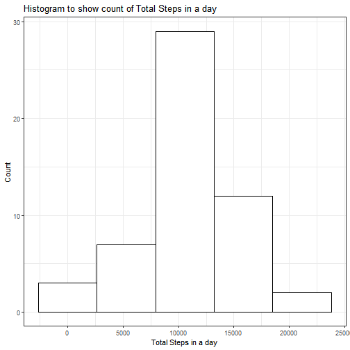
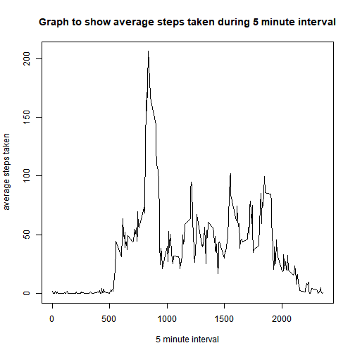
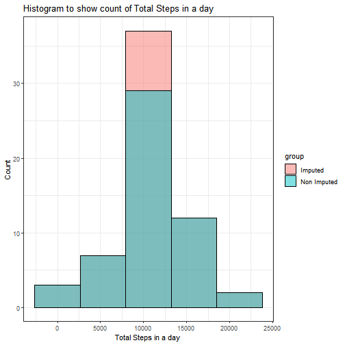
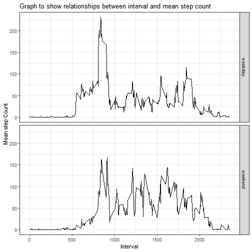

***
Investigating Activity Monitoring Data
======================================

Loading the nessessary packages for the assignment:


```r
library(data.table)
library(plyr)
library(tidyverse)
library(lubridate)
```

***
Loading and Preprocessing Data
===

***

#### 1. Load the data (i.e. read.csv()) ####

***

Downloading file from destination and checking if it already exists. Next loading the data using the fread() function from the *data.tables* package and converting it into a tibble format from the *tidyverse* package group and displaying the first 6 rows using head():


```r
if (!file.exists("activity.csv") )
    {
     url <- 'http://d396qusza40orc.cloudfront.net/repdata%2Fdata%2Factivity.zip'  
     download.file(url,'repdata%2Fdata%2Factivity.zip')  
     unzip('repdata%2Fdata%2Factivity.zip')
    }
```


```r
data <- fread("activity.csv")
data <- as_tibble(data)
data_r <- data
data$steps <- as.double(data$steps)
head(data)
```

```
## # A tibble: 6 x 3
##   steps date       interval
##   <dbl> <date>        <int>
## 1    NA 2012-10-01        0
## 2    NA 2012-10-01        5
## 3    NA 2012-10-01       10
## 4    NA 2012-10-01       15
## 5    NA 2012-10-01       20
## 6    NA 2012-10-01       25
```

***
#### 2. Process/transform the data (if necessary) into a format suitable for your analysis ####
***
Data is grouped by date and the NA values are removes:


```r
data <- filter(data, !is.na(data))
gdate <- group_by(data, date)
perday_data <- select(gdate, date, steps)
perday_data_t <- summarize(perday_data, sum(steps))
names(perday_data_t) <- c("dates","total_steps")
```

***
What is mean total number of steps taken per day?
===

***

#### 1. Make a histogram of the total number of steps taken each day ####
***

Now using the data a histogram is plotted for the total number of steps taken each day (ignoring the NA values):


```r
p <- ggplot(perday_data_t, aes(total_steps))

print(p + geom_histogram(bins = 5, color = "black", fill="white") + theme_bw() + labs(x = "Total Steps in a day", y = "Count") + ggtitle("Histogram to show count of Total Steps in a day") )
```



***
#### 2. Calculate and report the mean and median total number of steps taken per day ####
***

Next the the mean and median total number of steps taken per day is found using the grouped data frame *perday_data_t* and the *summarize()* function:


```r
summary(perday_data_t)
```

```
##      dates             total_steps   
##  Min.   :2012-10-02   Min.   :   41  
##  1st Qu.:2012-10-16   1st Qu.: 8841  
##  Median :2012-10-29   Median :10765  
##  Mean   :2012-10-30   Mean   :10766  
##  3rd Qu.:2012-11-16   3rd Qu.:13294  
##  Max.   :2012-11-29   Max.   :21194
```
***
What is the average daily activity pattern?
===
***

#### 1. Make a time series plot (i.e. type = "l") of the 5-minute interval (x-axis) and the average number of steps taken, averaged across all days (y-axis) ####

***
Select the data for the 5-minute interval and the average steps taken 


```r
# Preporcessing

idata <- group_by(data, interval)
idata <- select(idata, interval, steps)
idata_m <- summarize(idata, mean(steps))
names(idata_m) <- c("interval", "mean_steps")
# Plot
plot(x = idata_m$interval, y = idata_m$mean_steps, xlab ="5 minute interval", type = "l",ylab = "average steps taken", main = "Graph to show average steps taken during 5 minute interval")
```



#### 2. Which 5-minute interval, on average across all the days in the dataset, contains the maximum number of steps? #### 


```r
max_row <- which.max(idata_m$mean_steps)
idata_m <- as.data.frame(idata_m)
idata_m[max_row,]
```

```
##     interval mean_steps
## 104      835   206.1698
```

***
Imputing missing values
===
***
#### Note that there are a number of days/intervals where there are missing values (coded as NA). The presence of missing days may introduce bias into some calculations or summaries of the data. ####
***
#### 1. Calculate and report the total number of missing values in the dataset (i.e. the total number of rows with NAs) #### 
***

First the number of NA's within the dataset

```r
sum(is.na(data_r))
```

```
## [1] 2304
```


***
#### 2. Devise a strategy for filling in all of the missing values in the dataset. The strategy does not need to be sophisticated. For example, you could use the mean/median for that day, or the mean for that 5-minute interval, etc. #### 
***

There are 2304 NA values which will have to be replaced. It was decided to replace the values with the consequent means as found from the previous question.

***
#### 3. Create a new dataset that is equal to the original dataset but with the missing data filled in. ####

***
Using the raw extracted data *data_r* and the previously computed table on means *idata_m* the *NA* values will be replaced with the consequent mean in a for loop. Lastly it is checked weather the *NA* values have been replaced: 


```r
na_rows <- which(is.na(data_r$steps))
data_r$steps <- as.double(data_r$steps)
dna_rows <- data_r[na_rows,]

for (r in 1:dim(dna_rows)[1]){

data_r[na_rows,][r,]$steps <- filter(idata_m, idata_m$interval == dna_rows[r,]$interval)$mean_steps

} 

table(is.na(data_r))
```

```
## 
## FALSE 
## 52704
```

***
#### 4. Make a histogram of the total number of steps taken each day and Calculate and report the mean and median total number of steps taken per day. Do these values differ from the estimates from the first part of the assignment? What is the impact of imputing missing data on the estimates of the total daily number of steps? ####
***


```r
#### Code taken from the previous perday_data calculation now preprocessing for perday_data_r

gdate_r <- group_by(data_r, date)
perday_data_r <- select(gdate_r, date, steps)
perday_data_t_r <- summarize(perday_data_r, sum(steps))
names(perday_data_t_r) <- c("dates","total_steps")
```

Now the two data sets *perday_data_t* and *perday_data_t_r* will be put together :


```r
perday_data_t$group <- "Non Imputed"
perday_data_t_r$group <- "Imputed"

group <- rbind(perday_data_t, perday_data_t_r)

unique(group$group)
```

```
## [1] "Non Imputed" "Imputed"
```

Layered plot:


```r
#### Layered Histogram plot

p <- ggplot(group, aes(total_steps, fill = group))

print(p + geom_histogram(bins = 5, color = "black", alpha = 0.5, position = 'identity') + theme_bw() + labs(x = "Total Steps in a day", y = "Count") + ggtitle("Histogram to show count of Total Steps in a day"))
```



Unlayered plot:


```r
#### Side by Side Histogram plot

p <- ggplot(group, aes(total_steps, facet = group))

print(p + geom_histogram(bins = 5, color = "black", alpha = 0.5, position = 'identity') + theme_bw() + labs(x = "Total Steps in a day", y = "Count") + ggtitle("Histogram to show count of Total Steps in a day")+facet_wrap(~group) )
```


Calculating and comparing mean and median as well as converting to data frame to have correct number of sigfigs:

Imputed DF:

```r
median(data.frame(perday_data_t_r)$total_steps)
```

```
## [1] 10766.19
```


```r
mean(data.frame(perday_data_t_r)$total_steps)
```

```
## [1] 10766.19
```
NON Imputed DF:


```r
median(data.frame(perday_data_t)$total_steps)
```

```
## [1] 10765
```


```r
mean(data.frame(perday_data_t)$total_steps)
```

```
## [1] 10766.19
```

By imputing the data frame the median has increased.

***
Are there differences in activity patterns between weekdays and weekends?
===
***
#### For this part the weekdays() function may be of some help here. Use the dataset with the filled-in missing values for this part. #### 
***
#### 1. Create a new factor variable in the dataset with two levels -- "weekday" and "weekend" indicating whether a given date is a weekday or weekend day. ####
***


```r
x <- split(data_r, weekdays(data_r$date) %in% c("Saturday","Sunday") )

weekend_y <- x$`TRUE`
weekend_n <- x$`FALSE`


gint_y <- group_by(weekend_y, interval)
perint_y <- select(gint_y , interval, steps)
perint_y <- summarize(perint_y, mean(steps))
names(perint_y) <- c("interval","total_steps")

gint_n <- group_by(weekend_n, interval)
perint_n <- select(gint_n , interval, steps)
perint_n <- summarize(perint_n, mean(steps))
names(perint_n) <- c("interval","total_steps")

perint_n$day <- "weekday"
perint_y$day <- "weekend" 

data_n <- rbind(perint_n, perint_y)
```

***
#### 2.Make a panel plot containing a time series plot (i.e. type = "l") of the 5-minute interval (x-axis) and the average number of steps taken, averaged across all weekday days or weekend days (y-axis). ####
***


```r
#### Side by Side Histogram plot

p <- ggplot(data_n, aes(interval,total_steps, facet = day))

print(p + geom_line() + theme_bw() + labs(x = "Interval", y = "Mean step Count") + ggtitle("Graph to show relationships between interval and mean step count")+facet_grid(day~.) )
```



From the plot it can be seen that during the weekdays there is a higher peak at around 850.
